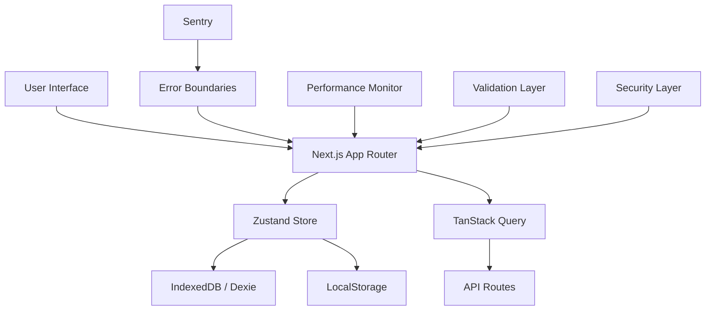

<div align="center">

# Habit Tracker 
### *Build better habits. Track with clarity.*

[](https://nextjs.org/)
[](https://www.typescriptlang.org/)
[](https://tailwindcss.com/)
[](https://reactjs.org/)
[](https://web.dev/progressive-web-apps/)
[](LICENSE)
[](https://vitest.dev/)
[](https://storybook.js.org/)

</div>

---

# 📖 Overview

**Habit Tracker Pro** is a modern, full-stack habit management application built with performance, offline capability, and accessibility at its core. It offers smart tracking, rich analytics, gamification, and end-to-end encryption—all in a clean, responsive interface.

### 🌐 Live Demo

- **Primary:** https://habit-tracker25.netlify.app/
- **Alternative:** https://habit-tracker-eight-iota-17.vercel.app/

---

# ✨ Features

- 🧠 **Smart Habit Tracking** — Flexible recurrence (daily, weekly, custom), intelligent date handling, and dependency chains.
- 📊 **Powerful Analytics** — Heatmaps, streak visualizations, completion charts, and performance insights powered by Recharts.
- 🏆 **Gamification** — Unlockable achievements, milestone badges, and a rewards system.
- 📱 **Offline-First & PWA** — Install on any device and continue tracking without an internet connection.
- ⚡ **Enterprise Reliability** — Zod validation, error boundaries, circuit-breaker patterns, and Core Web Vitals monitoring.
- ♿ **Accessibility** — WCAG 2.1 AA compliant with keyboard navigation and internationalization support.
- 🔒 **Privacy & Security** — Client-side encryption, XSS/CSRF protection, strict CSP, and zero third-party tracking.
- 📦 **Data Portability** — Export your habits anytime as JSON, CSV, or PDF.

---

# 🛠 Tech Stack

| Category | Technology |
|----------|------------|
| **Framework** | Next.js (App Router) |
| **Language** | TypeScript (Strict Mode) |
| **UI** | React, Tailwind CSS, Radix UI, Framer Motion |
| **State Management** | Zustand, Immer, TanStack Query |
| **Database** | Dexie.js (IndexedDB) |
| **Forms & Validation** | React Hook Form, Zod |
| **Charts** | Recharts |
| **Testing** | Vitest, Testing Library, Playwright |
| **Monitoring** | Sentry |
| **Bundle Analysis** | @next/bundle-analyzer |
| **CI/CD** | GitHub Actions, Vercel, Netlify |

---

# 🏗 Architecture



### Architecture Highlights

- Atomic Design (Atoms → Molecules → Organisms)
- Offline-first storage with automatic database migrations
- Progressive enhancement
- Secure client-side architecture
- High-performance rendering
- Modular and scalable project structure

---

# 📁 Project Structure

```text
src/
├── app/                     # Next.js App Router pages & API routes
├── components/
│   ├── atoms/               # Primitive UI elements
│   ├── molecules/           # Composed UI components
│   ├── organisms/           # Complex UI sections
│   └── charts/              # Recharts visualizations
├── core/                    # Business logic & utilities
├── hooks/                   # Custom React hooks
├── lib/                     # Third-party wrappers
├── store/                   # Zustand stores
├── types/                   # Global TypeScript types
└── __tests__/               # Unit & integration tests
```

---

# 🚀 Getting Started

## Prerequisites

- Node.js **20+**
- npm **10+**

## Installation

```bash
git clone https://github.com/JahanzaibJameel/Habit-Tracker.git

cd Habit-Tracker

npm install

cp .env.example .env.local

npm run dev
```

Application will start at:

```
http://localhost:3000
```

---

# 📜 Available Scripts

| Command | Description |
|---------|-------------|
| `npm run dev` | Start development server |
| `npm run build` | Production build |
| `npm run start` | Start production server |
| `npm run lint` | Lint the project |
| `npm run type-check` | TypeScript checking |
| `npm test` | Run unit & integration tests |
| `npm run test:e2e` | Run Playwright E2E tests |
| `npm run storybook` | Launch Storybook |
| `npm run analyze` | Analyze bundle size |

---

# 🧪 Testing

### Stack

- **Vitest**
- **Testing Library**
- **Playwright**

### Run Tests

```bash
npm test

npm run test:e2e

npm test -- --coverage
```

---

# 🚀 Deployment

## Vercel

Deploy instantly using Vercel.

https://vercel.com/new

---

## Docker

```bash
docker build -t habit-tracker .

docker run -p 3000:3000 habit-tracker
```

---

# ⚙ Environment Variables

```env
NEXT_PUBLIC_SENTRY_DSN=your_sentry_dsn

SENTRY_AUTH_TOKEN=your_auth_token

NEXT_PUBLIC_GA_ID=your_google_analytics_id
```

---

# ⚡ Performance

- ✅ LCP < 2.5s
- ✅ FID < 100ms
- ✅ CLS < 0.1
- ✅ Bundle < 200KB (gzipped)
- ✅ Route Chunks < 50KB

### Optimizations

- Automatic Code Splitting
- Tree Shaking
- Next.js Image Optimization
- CDN Ready
- Aggressive Caching
- Lazy Loading

---

# 🤝 Contributing

1. Fork the repository.
2. Create a feature branch.

```bash
git checkout -b feature/your-feature
```

3. Commit using Conventional Commits.

```bash
feat: add amazing feature
```

4. Push your changes.

5. Open a Pull Request.

Please follow the existing code style, include tests for new functionality, and maintain accessibility standards.

---

# 📚 Documentation

- Architecture Guide
- Component Library (Storybook)
- API Reference
- Testing Guide
- Deployment Guide

---

# 📄 License

This project is licensed under the **MIT License**.

See the **LICENSE** file for more details.

---

<div align="center">

### Built with focus, for personal growth.

⭐ **If you found this project useful, consider giving it a Star!**

</div>
